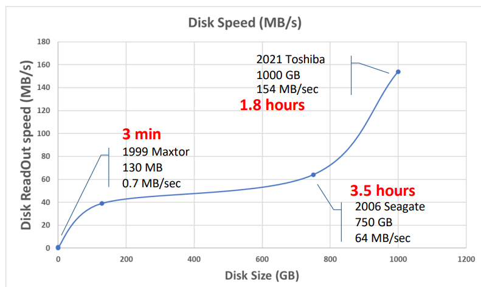
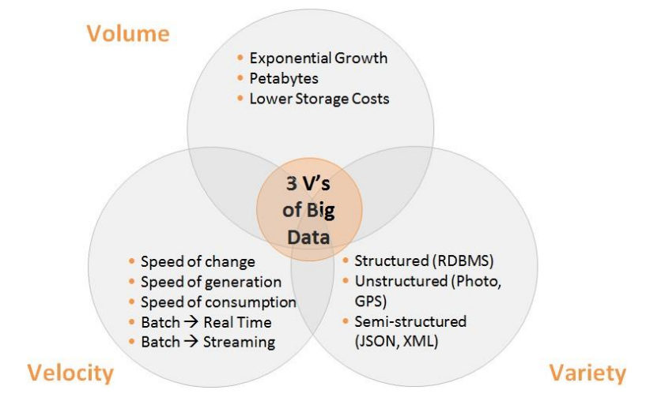

# Hadoop Basics
- [Hadoop Basics](#hadoop-basics)
  - [Big data - Introduction](#big-data---introduction)
    - [The Google Problem](#the-google-problem)
    - [The Problem of sequential Access](#the-problem-of-sequential-access)
    - [The Standard Big Data 3 V’s](#the-standard-big-data-3-vs)
    - [Solving the 3Vs with Hadoop](#solving-the-3vs-with-hadoop)
  - [Understanding Distributed Computing with Hadoop](#understanding-distributed-computing-with-hadoop)
    - [The Hadoop Stack](#the-hadoop-stack)
    - [Stack descripion](#stack-descripion)
    - [Hadoop Ideology](#hadoop-ideology)
    - [How to get a Hadoop Cluster](#how-to-get-a-hadoop-cluster)

## Big data - Introduction

In today's digital age, the volume, variety, and velocity of data being generated are unprecedented. Traditional data processing methods are unable to cope with the sheer scale and complexity of this data, leading to what is commonly known as the "Big Data" problem. Hadoop emerges as a powerful solution to tackle these challenges, offering distributed computing capabilities to process and analyze massive datasets efficiently.

### The Google Problem
To grasp the magnitude of the Big Data challenge, consider the example of Google's indexing efforts:
- With approximately 60 billion web pages globally and a median size of 20 kilobytes per page, we are dealing with a staggering 1.23 petabytes of data.
- Processing this data sequentially, assuming a disk read/write speed of 100 megabytes per second, would take over 3.75 years!

Data sources:
- https://siteefy.com/how-many-websites-are-there/#The-total-number-of-websites-indexed-in-Google
- https://www.worldwidewebsize.com/
- https://www.pingdom.com/blog/webpages-are-getting-larger-every-year-and-heres-why-it-matters/#%3A~%3Atext%3DThe%20average%20webpage%20size%20is%2Cfrom%20892%20processed%20websites

### The Problem of sequential Access
The traditional approach to data access faces limitations in terms of capacity and access speed, leading to a **congestion paradox** where accessing all data becomes increasingly difficult as datasets grow larger.

### The Standard Big Data 3 V’s
Big Data is characterized by three main attributes:

- **Volume**: Data is growing exponentially, often reaching petabyte scales, with decreasing storage costs.
- **Variety**: Data comes in various forms, including structured, unstructured (RDBMS, Photo, GPS), and semi-structured data (JSON, XML), posing challenges in storage and processing.
- **Velocity**: Data is generated and updated at unprecedented speeds, requiring real-time or near-real-time processing capabilities.
  - Speed of change
  - Speed of generation
  - Speed of consumption
  - Batch -> Real Time
  - Batch -> Streaming

### Solving the 3Vs with Hadoop
Hadoop provides solutions to the challenges posed by Big Data through its distributed computing framework and ecosystem of tools.

1. **Volume**: Hadoop enables distributed storage and computing, leveraging clusters of commodity hardware (from super computers to PCs) and parallel processing algorithms like MapReduce.
2. **Variety**: With schema-on-read and support for NoSQL databases, Hadoop accommodates diverse data formats and sources seamlessly.
3. **Velocity**: Hadoop facilitates streaming processing, allowing organizations to handle data at the speed of its generation.

## Understanding Distributed Computing with Hadoop
Traditionally, computing was confined to single machines. Hadoop revolutionizes this paradigm by enabling distributed computing across clusters of machines.

### The Hadoop Stack

Hadoop's ecosystem comprises various components for data processing, management, and resource allocation:
- **Data Processing:** Includes tools like Hive, Hadoop map-reduce, Pig, Spark, HBase, Oozie and MPI for processing and analyzing data.
- **Data Management:** Hadoop Distributed File System (HDFS) for distributed storage. It is a distributed file system designed to store large volumes of data reliably across commodity hardware. It provides high-throughput access to data and ensures fault tolerance by replicating data across multiple nodes.
- **Resource Management:** YARN, MESOS, or Spark for managing cluster resources efficiently.
  - **Yet Another Resource Negotiator (YARN):** A resource management and job scheduling framework in Hadoop 2.x. It separates the resource management and job scheduling functions from the MapReduce engine, allowing multiple data processing frameworks to run on the same cluster.
  - **Apache Mesos:** A distributed systems kernel that abstracts CPU, memory, storage, and other resources across clusters. It provides efficient resource isolation and sharing for running diverse distributed applications.
  - **Apache Spark:** Besides its data processing capabilities, Spark also includes a resource management component for allocating resources efficiently across Spark applications running on a cluster.

### Stack descripion
- **Core Technologies:**
  - **HDFS:** The foundational storage layer of Hadoop.
  - **MapReduce:** The traditional processing engine of Hadoop.
- **Ingesting Data:**
  - **Sqoop:** A tool for transferring data between Hadoop and structured data stores such as relational databases.
  - **Flume:** A distributed, reliable, and available service for efficiently collecting, aggregating, and moving large amounts of streaming data into Hadoop.
- **High-Level APIs:**
  - **Pig:** For data flow programming and executing MapReduce jobs using Pig Latin scripts.
  - **Hive:** Provides a SQL-like interface to query and analyze data stored in Hadoop.
- **Key-Value Stores in HDFS:**
  - **HBase:** A scalable, distributed database built on top of HDFS, offering real-time read/write access to large datasets.
- **Orchestration Workflows:**
  - **Oozie:** A workflow scheduler system for managing Hadoop jobs.
- **Distributed Coordinator:**
  - **ZooKeeper:** A centralized service for maintaining configuration information, naming, providing distributed synchronization, and group services.

### Hadoop Ideology

- Applications in high-level code: not to worry about low-level resources, synchronization and data handling.
- Hadoop operates on the principles of shared-nothing architecture, where components (JVM) do not share state. It includes error handling, reliability.
- Data is spread and replicated among machines for fault tolerance and scalability.
  - Bring code to data
  - I/O bounded, not CPU bound

### How to get a Hadoop Cluster

You can set up a Hadoop cluster through:

- Open Source distributions like:
  - Apache Hadoop
  - Fully in your own
- Commercial distributions like:
  - Cloudera + Hortonworks
- Public Cloud solutions offered by providers like:
  - IaaS: install / manage whatever via VM / Docker images
  - PaaS: cloud provider provides images and management: GCP, AWS, Azure

