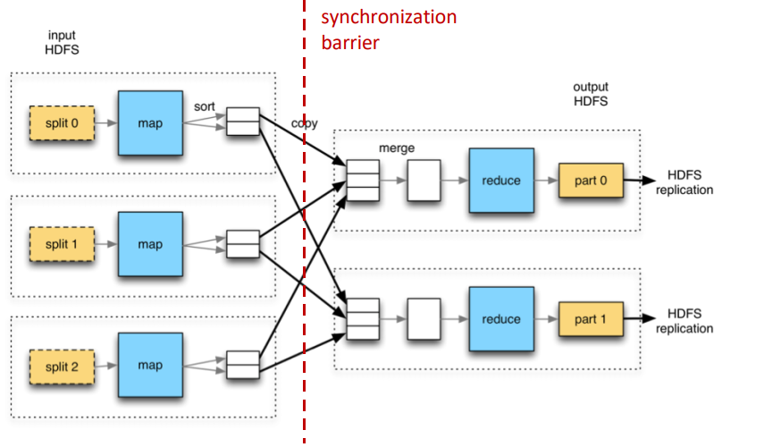
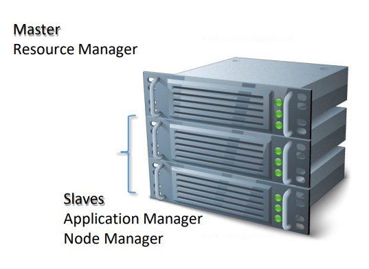

## Introduction to MapReduce
- [Introduction to MapReduce](#introduction-to-mapreduce)
  - [M\&Ms jar example](#mms-jar-example)
  - [What is MapReduce?](#what-is-mapreduce)
  - [How MapReduce Works](#how-mapreduce-works)
    - [Map](#map)
    - [Reduce](#reduce)
- [Hadoop MapReduce](#hadoop-mapreduce)
  - [Overview](#overview)
  - [Data Structure](#data-structure)
  - [Problem Examples](#problem-examples)
    - [Word Count](#word-count)
    - [Counting IP Addresses](#counting-ip-addresses)
  - [Implementation with HDFS](#implementation-with-hdfs)
  - [The Mapper](#the-mapper)
    - [Overview](#overview-1)
    - [Example](#example)
    - [Mapper Characteristics](#mapper-characteristics)
  - [The Reducer](#the-reducer)
    - [Overview](#overview-2)
    - [Reducer Function](#reducer-function)
    - [Output](#output)
- [Exercise - Streaming in Hadoop](#exercise---streaming-in-hadoop)
  - [Explanation of the process using an example](#explanation-of-the-process-using-an-example)
- [MapReduce: jobs, tasks, combiner, partitioner](#mapreduce-jobs-tasks-combiner-partitioner)
  - [Key Terms](#key-terms)
  - [Features](#features)
  - [System Schema](#system-schema)
  - [Combiner](#combiner)
  - [Partitioner](#partitioner)
- [Master-Worker Architecture](#master-worker-architecture)
  - [Master Nodes](#master-nodes)
  - [Worker Nodes](#worker-nodes)
  - [Job History Server](#job-history-server)
  - [YARN Resource Manager](#yarn-resource-manager)
  - [Running a Job in Hadoop](#running-a-job-in-hadoop)
    - [Key Concepts](#key-concepts)
    - [Process](#process)
- [YARN - General Platform Overview](#yarn---general-platform-overview)
  - [Key Features](#key-features)
  - [Running Applications in YARN](#running-applications-in-yarn)
- [Resource Manager](#resource-manager)
- [Node Manager](#node-manager)


### M&Ms jar example

Have you ever tried counting the number of M&Ms in a jar? Imagine you need to count them accurately. The most efficient way would be to distribute the task among all the employees in the office, with each person counting a portion of the M&Ms. This approach is similar to how MapReduce works:

- **Map Phase:** Each worker (slave node) applies a map function to their portion of the data, much like each person counting the M&Ms they received.
- **Reduce Phase:** After counting, the results from all workers are combined (reduced) to get the final count, similar to summing up the counts from each person.


### What is MapReduce?


MapReduce is a high-level programming model and implementation designed for large-scale parallel data processing. It allows developers to write programs that can process vast amounts of data across many machines in a distributed manner. 

**Key Components of the Programming Model:**
- **Operations:** `map` and `reduce`
- **Data Model:** Key-value pairs

The Hadoop framework handles the complexities of task coordination and resource management, making it easier for developers to focus on the core logic of their applications.


### How MapReduce Works

#### Map

In the map phase, the data is split into chunks (similar to elements in an array), and a function is applied to each element independently. For example, consider the following Python code that squares each number in a list:

```python
map(lambda x: x*x, [1, 2, 3, 4])
```

This will output `[1, 4, 9, 16]`.

#### Reduce

In the reduce phase, the intermediate results produced by the map phase are aggregated to produce the final result. The reduce function is applied iteratively to pairs of values to combine them into a single output. Here’s how it works in Python:

```python
from functools import reduce

# Summation operation
sum_op = lambda x, y: x + y
print(reduce(sum_op, [1, 2, 3, 4]))  # Output: 10

# Subtraction operation
min_op = lambda x, y: x - y
print(reduce(min_op, [1, 2, 3]))  # Output: -4
print(reduce(min_op, [3, 2, 1]))  # Output: 0
```

**Note:** Be careful with the reduce operation, especially if it is not associative. Associativity means that the order of operations does not affect the result. For example, addition (`+`) is associative, but subtraction (`-`) is not, which can lead to different results based on the order of elements.


## Hadoop MapReduce

### Overview

Hadoop MapReduce abstracts the complexities of distributed systems, allowing you to focus solely on implementing the `Map` and `Reduce` functions. The framework handles the distribution and parallel processing of data across a cluster.

### Data Structure

- **Key-Value Pairs:** Data is represented as key-value pairs, where the key is an identifier, and the value is the associated data. Therefore, in MapReduce, all data is expressed as key-value pairs, even if the key is not used explicitly. This approach simplifies the processing of data in parallel. 
- **Associative Memory:** This model is flexible and can be applied to a wide range of problems. Any SQL query can be expressed as a combination of map and reduce operations.

### Problem Examples
#### Word Count

Consider the classic word count problem, where the goal is to count how many times each word appears in a book. This can be efficiently done using MapReduce, with each word being a key and the count being the value.


#### Counting IP Addresses

To count the number of times different IP addresses have accessed a system, you can use the following series of command-line and Python scripts:

```bash
$ cd /home/cloudera/dh-course/02-mapreduce
cat access.log | ./map-log.py | sort | ./red-log.py | sort | ./map-sort-log.py | sort -g r
```

In this example:
- `map-log.py` processes the log file and emits key-value pairs.
- `red-log.py` aggregates the results.
- `map-sort-log.py` further processes the sorted output.
- The final `sort -g r` command sorts the results numerically in reverse order.


### Implementation with HDFS

Hadoop takes care of all the low-level details involved in distributed processing. As a user, you only need to define the following:

- **Input/Output Intermediate Key-Value Pairs:** These can be any data type that your application requires.
- **Map and Reduce Functions:** These are the core functions you implement to process and aggregate data.

By focusing on these components, you can leverage the power of Hadoop MapReduce to solve complex data processing problems efficiently and at scale.


### The Mapper

#### Overview

The **Mapper** function processes input data and generates intermediate key-value pairs. It may or may not use the input key, depending on the specific application.

**Data Locality**: Hadoop aims to run Mappers on the same nodes where the data resides, minimizing network traffic and improving performance.

#### Example

Consider a text file where each line of text is an input record:
- **Key:** Byte offset of the line's start.
- **Value:** Content of the line.
- In this case, the key (byte offset) is not used in the processing.


#### Mapper Characteristics

- **Parallel Execution:** Mappers run in parallel, each processing a separate chunk of data (blocks).
- **Input:** Mappers read data as key-value pairs.
- **Output:** Mappers produce a list of key-value pairs (list).

```python
def map(in_key, in_value):
    # Process input and generate output key-value pairs
    return [(out_key, out_value), ...]
```


### The Reducer

#### Overview

After the map phase, all intermediate values associated with the same output key are grouped into a list. This list is then processed by a **Reducer**.

#### Reducer Function

- **Key Grouping:** All values with the same key are passed to the same Reducer.
- **Multiple Keys:** A Reducer can receive multiple keys, but keys are sorted and passed in order (a process known as "shuffle and sort").

#### Output

Reducers can also produce key-value pairs, which are then written to HDFS.

```python
def reduce(out_key, values_list):
    # Process list of values for each key and generate output key-value pairs
    return [(final_key, final_value), ...]
```


## Exercise - Streaming in Hadoop

**"Streaming"** in Hadoop refers to the ability to run MapReduce jobs using scripting languages such as Python, Perl, or Ruby, rather than Java. This allows for greater flexibility and ease of use for those familiar with these languages.

**Key Points**

- **Scalability:** The same code used on the command line can be scaled to run on Hadoop, processing large datasets efficiently.
- **Hadoop Streaming Library:** This library facilitates the use of non-Java languages for MapReduce tasks.

### Explanation of the process using an example

1. **Data Partitioning:** Hadoop splits large text files into smaller chunks, each containing a different number of lines.
2. **Mapping Phase:** Each chunk is processed independently by its own mapper. Mappers run the specified Python scripts to process the data in each line of the text files.
3. **Reducing Phase:** Reducers receive the intermediate (key, value) pairs generated by the mappers. Reducers run the specified Python scripts to aggregate and finalize the data.
4. **Streaming Execution:** The Python code for mappers and reducers is streamed and executed in the Hadoop environment. In other words, mappers and reducers execute Python code (or other scripting language code) that is streamed to a Python interpreter (or corresponding interpreter for other languages).

This approach leverages the power of Hadoop's distributed processing while allowing the use of more familiar scripting languages, making it accessible and powerful for a wide range of data processing tasks.


## MapReduce: jobs, tasks, combiner, partitioner

### Key Terms

- **Job:** A complete execution of a set of Mappers and Reducers.
- **Task:** The execution of a single Mapper or Reducer over its assigned data.
- **Task Attempt:** 
    - An individual instance attempting to execute a task.
    - There will be at least as many task attempts as there are map and reduce tasks.
    - There can be more due to speculative execution, which runs the same task on multiple nodes and uses the first result returned to handle slow nodes.
    - If a task attempt fails, another will be started.

### Features

- **Automatic Parallelization and Distribution of tasks:** 
    - Provides a clean programming abstraction.
    - The native language is Java, but other languages can be used via Hadoop streaming.
    - The framework abstracts the complexities of parallelization and task coordination.
- **Automatic Fault-Tolerance:** 
    - Automatically handles task failures by restarting tasks.
- **Monitoring Tools:** 
    - Offers tools to monitor job and task progress and performance.


### System Schema


### Combiner
In the word-count example, the mapper's output can be inefficient because it generates many duplicated key-value pairs, which need to be sent over the network. For example:
```
('bigdata',1),('bigdata',1) ...
```
To optimize this, if the reduce operations are commutative and associative, we can use a combiner. The combiner performs a local reduction on each mapper, which reduces the number of key-value pairs that need to be sent across the network. This process generates "partial" reductions, such as:
```
('bigdata',2),('bigdata',3) ...
```


### Partitioner
MapReduce ensures that all pairs with the same key are sent to a single reducer. However, if one key has significantly more values than others (e.g., key = month, value = operations), this can cause an imbalance where one reducer has a lot of work while others are idle, reducing the benefits of parallelization.

A **partitioner** helps address this issue by redistributing keys to balance the workload among reducers. It determines which reducer will handle each key based on specific criteria. This functionality is implemented as a Java class.

By using a partitioner, you can achieve a more balanced distribution of work, leading to better performance and resource utilization.

Example of an architecture with a Partitioner:


## Master-Worker Architecture

### Master Nodes
- **Role:** 
    - Run daemons to accept jobs and allocate resources for a job.
    - Distribute and monitor work.
- **Components:**
    - **Resource Manager**: Allocates resources for a job and starts the **Application Manager**.

### Worker Nodes
- **Role:** 
    - Run daemons to start tasks.
    - Perform the actual work.
    - Report status.
- **Components:**
    - **Node Manager**: Runs on all worker nodes, starts, and monitors the actual tasks.



### Job History Server
- **Role:** Archives tasks and metadata.
- **Placement:** Only one per cluster, not part of master or worker nodes.


### YARN Resource Manager
- Yet Another Resource Negotiator (YARN) daemons are used for both Resource Manager and Node Manager.
- **Overview:** YARN is a core component of Hadoop that manages resources and job scheduling in a Hadoop cluster. It provides resource management and application lifecycle management, allowing multiple data processing engines to handle data stored in HDFS in a distributed and efficient manner.

- **Co-location with HDFS**: Typically, YARN and HDFS are co-located on the same nodes. This means that the same set of nodes in the cluster is used to run both YARN daemons (Resource Manager, Node Manager) and HDFS daemons (NameNode, DataNode). This setup optimizes data locality and reduces the amount of data that needs to be transferred over the network.


### Running a Job in Hadoop
#### Key Concepts
- **Resource Manager:** Continuously pings cluster nodes to monitor their status, maintaining a table of each node's status. It launches the Application Master and provides it with node information. Acts like a project manager.
- **Application Master:** Acts like a team lead, managing the execution of tasks on each node once they are defined and assigned.


#### Process
This process ensures efficient resource management and task execution in a distributed Hadoop environment. The process is explained using an example:

1. **Loading Data:** HDFS `data.txt` is loaded into block 1 on datanode 1 and block 2 on datanode 3.
2. **Submitting a Job:** The client submits the job using `hadoop jar mr.jar MyJob data.txt output` to the Resource Manager.
3. **Creating the Application:** The Resource Manager creates the Application Master in one of the Node Managers.
4. **Application Negotiating Resources:** The Application Master negotiates with the Resource Manager for resources.
5. **Starting Map Tasks:** The Application Master starts Map Tasks, each in a different Node Manager.
6. **Mappers Working:** Each Map Task processes data and creates intermediate data (`inter.data`) on each DataNode.
7. **Shuffling:** The Application Master invokes the Reduce Task in a free Node Manager.
8. **Reduce Phase:** The Reduce Task processes the intermediate data and creates the final `part-00000` files, which are stored in the HDFS `outdir/`.
9. **Recording Job Outcome:** The Application Master communicates with the Job History Server to log the job outcome.
10. **Job Completion:** The Application Master informs the Resource Manager to free up resources.


## YARN - General Platform Overview
- YARN is a distributed processing framework designed to efficiently manage computing resources within a cluster environment.
- It abstracts resources into containers, providing isolation for executing tasks.

### Key Features
- **Containerization:** YARN encapsulates tasks within containers, ensuring isolation at both the container and host node levels. Containers are defined by resource specifications such as memory and core requirements.
- **General-purpose:** YARN supports various processing frameworks including MapReduce, Impala, Spark, and Giraph, making it versatile for diverse workload requirements.
- **Scalability:** Suitable for very large clusters, YARN offers scalability and can efficiently manage resources even in massive computing environments. For even larger clusters, integration with frameworks like MESOS is possible.

### Running Applications in YARN
- **Understanding Jobs:** In YARN, a job refers to an application consisting of mapper and reducer tasks along with a list of inputs.
- **Task Management:** Tasks represent individual units of work, such as a mapper operating on an HDFS block. Jobs can comprise multiple tasks, each running within a container on a slave node.
- **Client Interaction:** The client program submits jobs to the ResourceManager, typically running on a node within the cluster.
- **Container Allocation:** ResourceManager allocates containers based on resource requirements, including memory and CPU specifications.
- **Application Master:** Each job has its Application Master running within a dedicated container. The Application Master coordinates Map-Reduce tasks, communicating with the ResourceManager to obtain the necessary containers for execution.


## Resource Manager
Activities carried out:
- **Node Management:** Oversees the cluster's nodes, ensuring their health by regularly pinging them (every 1 second) to maintain awareness of their status.
- **Resource Scheduling:** Prioritizes and allocates resources based on specified priorities, ensuring efficient resource utilization.
- **Resource Management:** Handles container requests by assigning and deallocating containers as needed.
- **Security:** Controls access to cluster tasks, ensuring appropriate authorization and authentication measures are in place.

## Node Manager
In the worker nodes. Activities carried out:
- **Integration with Resource Manager:** Acts as a liaison between nodes and the Resource Manager, providing essential information about node resources and updating the Resource Manager on node status through regular heartbeats.
- **Process Handling:** Executes requests to launch applications, monitoring their resource usage, and terminating containers if necessary to prevent resource overutilization.
- **Logging:** Gathers and manages logs generated by applications and containers running on the node.
- **Security:** Manages access to the node, ensuring only authorized entities can interact with its resources and services.

