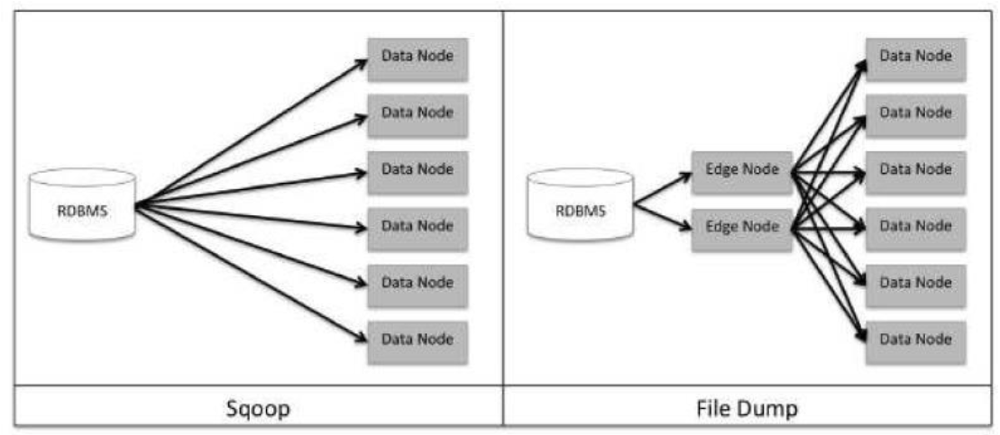
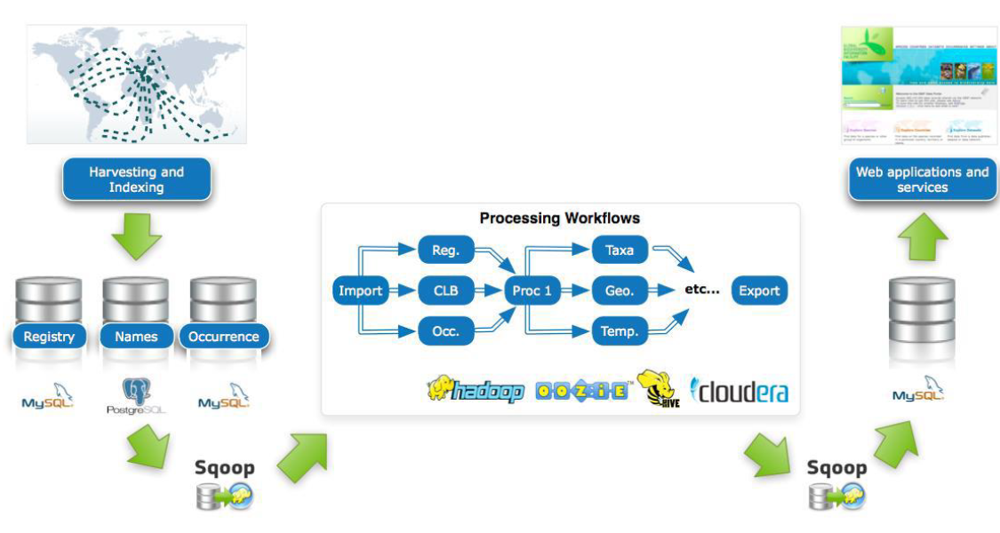
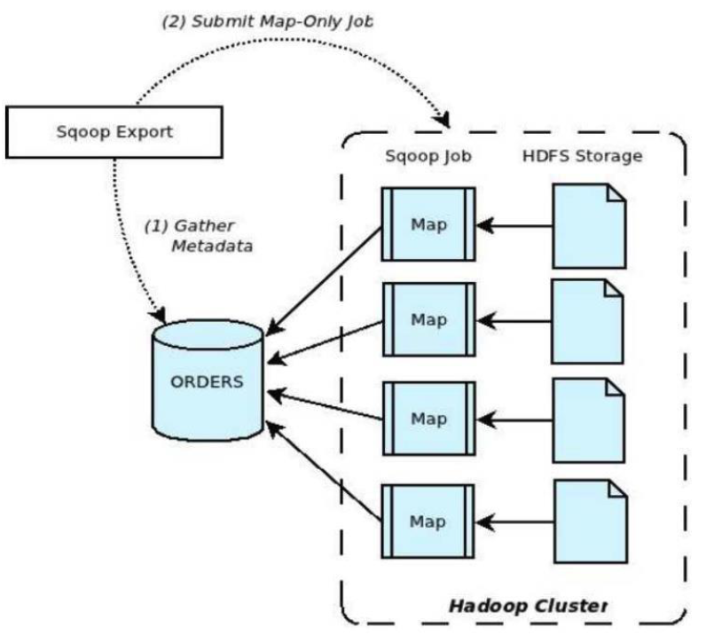
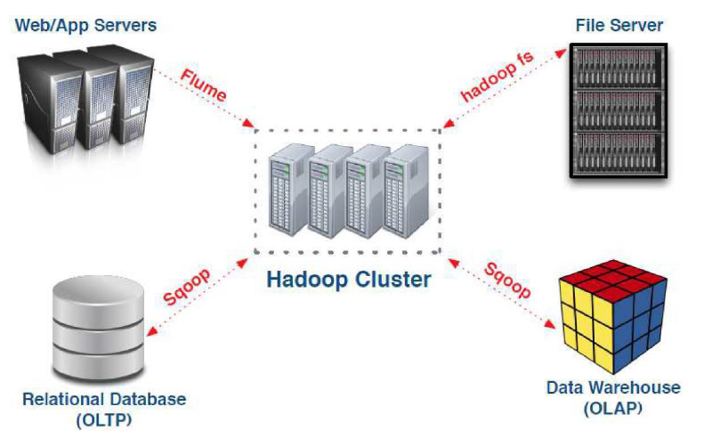

# Sqoop
- [Sqoop](#sqoop)
  - [General Landscape](#general-landscape)
    - [Data Ingestion](#data-ingestion)
      - [Sources](#sources)
      - [Characteristics](#characteristics)
      - [Types](#types)
  - [Sqoop](#sqoop-1)
    - [Overview](#overview)
    - [Functionality](#functionality)
    - [Commands](#commands)
    - [Recap on Data Ingestion - Export](#recap-on-data-ingestion---export)
  - [Sqoop Basic Syntax](#sqoop-basic-syntax)
    - [Import a Table](#import-a-table)
    - [Change the General Directory](#change-the-general-directory)
    - [Change the Table Directory](#change-the-table-directory)
    - [Parallelism Control](#parallelism-control)
    - [Select Columns to Import](#select-columns-to-import)
    - [Select Rows with Where Clause](#select-rows-with-where-clause)
    - [Compress Data](#compress-data)
    - [Select Rows with Free Form Query](#select-rows-with-free-form-query)
    - [Manage Import Tables](#manage-import-tables)
      - [Import All Tables](#import-all-tables)
      - [Import All Tables Except Some](#import-all-tables-except-some)


## General Landscape

### Data Ingestion
Hadoop is renowned for its high scalability, making it capable of handling massive data volumes. However, one of its primary challenges lies in efficiently ingesting this data.


#### Sources
Data can originate from various sources including:
- Relational Database or Mainframe
- Data generated in logs, machines, or web streams
- Files

#### Characteristics
- Time: Different ingestion types exhibit varying time ranges:

| **Ingestion Type**                          | **Time Range**               |
|---------------------------------------------|------------------------------|
| **Macro Batch**                             | 15 minutes to hours          |
| **Near Real-Time Decision Support (Micro Batch)** | 2 seconds to 15 minutes      |
| **Near Real-Time Event**                    | 100 milliseconds to 2 seconds|
| **Real-Time**                               | Less than 100 milliseconds   |


- Size: Ingestion data can vary from small drops to incremental updates, often employing data partitioning strategies.
- Sources: Data can be stored in different formats and undergo various transformations, either on-the-fly or through a subsequent ETL process.


#### Types
Different strategies are employed based on data types, transformation needs, and time constraints.
- According to data types:
  - File dump: Direct transfer of files.
  - JDBC-like: Utilizing SQL-like queries for extraction.
  - Streaming: Continuous ingestion using tools like Flume or Spark.

- Triggers: Ingestion can be triggered by events, either **push**ed from the source or **pull**ed by the Hadoop system.

- Ingestion Perimeter: Ingestion can occur across all nodes or be restricted to specific nodes (e.g. peripheral nodes) or external storage like NFS.



## Sqoop

### Overview
Sqoop facilitates the seamless import and export of data from structured sources such as databases. It provides the flexibility to store data directly in HDFS (Hadoop Distributed File System). Additionally, Sqoop's integration with Oozie enables automation of data transfer workflows.





### Functionality
Sqoop operates by launching a series of mappers, allowing for efficient data transfer:


- By default, Sqoop employs 4 mappers to execute parallel data transfer.
- This parallelism ensures optimized data movement while mitigating potential bottlenecks that could lead to database blocking.



### Commands
Sqoop commands are executed from the shell and include:

- `create-table-hive`: Create a table in Hive.
- `eval`: Evaluate a SQL sentence and show the result.
- `export`: Export data from HDFS to a database table.
- `import`: Import a table from a database to HDFS.
- `import-all-tables`: Import all tables from a database.
- `list-databases`: List the databases in the database management system.


Example command to connect to a MySQL database:

```
$ sqoop command host_bbdd
```

For MySQL database interaction:

```sh
$ mysql -u retail_dba -p
> cloudera

mysql> show databases;
mysql> use retail_db;
mysql> show tables;
mysql> select * from customers limit 1;
mysql> describe customers;
mysql> exit;
```

### Recap on Data Ingestion - Export

The below image illustrates the diverse sources of data ingestion into a Hadoop cluster, including streaming data, relational databases, files, and the subsequent export of data from the Hadoop cluster to a data warehouse for analytical purposes:

1. **Web/App Servers and Flume**: Flume is a distributed, reliable, and available service for efficiently collecting, aggregating, and moving large amounts of streaming data (such as log data) into the Hadoop ecosystem. Data from Web/App Servers can be ingested into the Hadoop cluster using Flume.

2. **Relational Database OLTP and Sqoop**: OLTP (Online Transaction Processing) databases are used for transaction-oriented applications, such as banking systems or e-commerce websites. Sqoop can be used for importing data from the OLTP database into the Hadoop cluster. Sqoop tool is designed for efficiently transferring bulk data.

3. **File Server and `haddop fs`**: data from the file server is ingested into the Hadoop cluster directly using HDFS commands.

6. **Data Warehouse (OLAP) and Sqoop**: OLAP (Online Analytical Processing) databases are used for data analysis and reporting. Sqoop can be used for exporting data from the Hadoop cluster to the OLAP database. In this scenario, Sqoop is mainly used in the export mode to transfer data from HDFS to the OLAP database for further analysis or reporting purposes.





## Sqoop Basic Syntax

### Import a Table
```sh
$sqoop import --connect jdbc:mysql://localhost/retail_db \
--username retail_dba --password cloudera --table customers
```
- Each table is stored in its own directory in the HDFS user folder.
- Check the number of `part-m-*` files:
```sh
$ hadoop fs -ls customers
$ hadoop fs -cat customers/part-m-00000
```

### Change the General Directory
```sh
$sqoop import --connect jdbc:mysql://localhost/retail_db \
--username retail_dba --password cloudera \
--table customers --warehouse-dir test
```
- By default, the user home directory in HDFS is used.
- The `--warehouse-dir` option changes the directory to another one.
```sh
$ hadoop fs -ls test
```

### Change the Table Directory
```sh
$sqoop import --connect jdbc:mysql://localhost/retail_db \
--username retail_dba --password cloudera \
--table customers --target-dir test-table
```
- The `--target-dir` option changes the directory where the table is stored.
```sh
$ hadoop fs -ls test-table
```

### Parallelism Control
- It is very important to avoid database block from concurrent access (especially inserts).
- Hadoop volume is usually much higher.
- By default, 4 mappers are used, split by the primary key.
- Change the number of mappers with `--num-mappers` (or `-m`):
```sh
$sqoop import --connect jdbc:mysql://localhost/retail_db \
--username retail_dba --password cloudera \
--table customers --num-mappers 2 --target-dir test-map
```
- Using `-m 1` writes to a single file (only one mapper).


**Split Column:**

Hint to parallelization: Use `--split-by` (default is primary key).
- Specify the table column used to produce partitions. Each mapper will process one partition, enhancing efficiency.
```sh
$sqoop import --connect jdbc:mysql://localhost/retail_db \
--username retail_dba --password cloudera \
--table customers --split-by "customer_state" --target-dir test-idh
```
- Look at the states represented:
```sh
$ hadoop fs -ls test-idh
$ hadoop fs -cat test-idh/part-m-00000 | grep ",state-present,"
```

### Select Columns to Import
```sh
$sqoop import --connect jdbc:mysql://localhost/retail_db \
--username retail_dba --password cloudera \
--table customers \
--columns "customer_city,customer_state" --target-dir test-partial
```
- Check the contents of the `part-000*` files:
```sh
$ hadoop fs -cat test-partial/part-m-00000
```

### Select Rows with Where Clause
```sh
$sqoop import --connect jdbc:mysql://localhost/retail_db \
--username retail_dba --password cloudera \
--table customers \
--where "customer_state='CA'" --target-dir test-CA
```
- Check the contents of the `part-000*` files:
```sh
$ hadoop fs -cat test-CA/part-m-00000
```

### Compress Data
```sh
$sqoop import --connect jdbc:mysql://localhost/retail_db \
--username retail_dba --password cloudera \
--table customers \
--compress \
--compression-codec org.apache.hadoop.io.compress.SnappyCodec --target-dir test-compress
```
- Check the contents of the `part-000*` files:
```sh
$ hadoop fs -ls test-compress
$ hadoop fs -cat test-compress/part-m-00000.snappy
```


### Select Rows with Free Form Query
```sh
$ export CONDITIONS="customer_state='CA'"
$ sqoop import --connect jdbc:mysql://localhost/retail_db \
--username retail_dba --password cloudera \
--query "select customer_city from customers where \$CONDITIONS" \
--split-by customer_id --target-dir test-query-CA
```
- `CONDITIONS` must be set, and `SPLIT-BY` must also be set.
- Be aware of escaping `$` in the script if using `"`.
- The split-by field should be present in the query.
- Check the contents of the `part-000*` files:
```sh
$ hadoop fs -cat test-query-CA/part-m-00000
```

### Manage Import Tables

#### Import All Tables
```sh
$ sqoop import-all-tables \
--connect jdbc:mysql://localhost/retail_db \
--username retail_dba --password cloudera \
--warehouse-dir test-all
```

#### Import All Tables Except Some
```sh
$ sqoop import-all-tables \
--connect jdbc:mysql://localhost/retail_db \
--username retail_dba --password cloudera \
--exclude-tables customers \
--warehouse-dir test-all-ex
```


