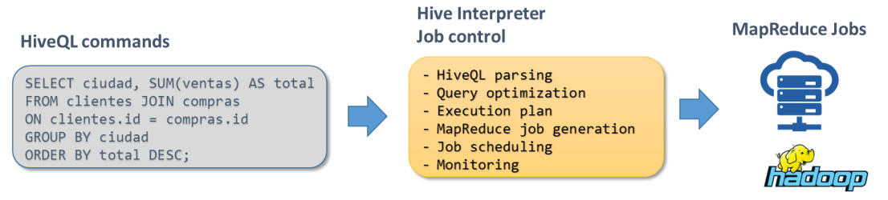
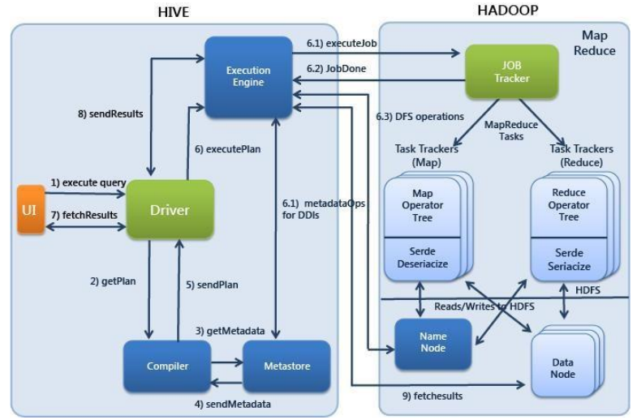

# Hive
- [Hive](#hive)
  - [Introduction](#introduction)
    - [Execution Schema](#execution-schema)
    - [User Interface - Console](#user-interface---console)
    - [Data Management](#data-management)
    - [Data Analysis - Tables and Data](#data-analysis---tables-and-data)
    - [Examples](#examples)
    - [Hive is not a relational database](#hive-is-not-a-relational-database)
  - [Architecture](#architecture)
    - [Local Mode vs Cluster Mode](#local-mode-vs-cluster-mode)
    - [Metastore Architecture](#metastore-architecture)
    - [Configuration parameters](#configuration-parameters)
    - [Execution Engine](#execution-engine)
    - [Web Consoles](#web-consoles)
  - [Hive SQL Language](#hive-sql-language)
    - [SELECT Statement](#select-statement)
    - [Query Combination](#query-combination)
    - [Data Types](#data-types)
    - [Joins](#joins)
    - [Aggregation](#aggregation)
    - [Grouping functions](#grouping-functions)
    - [Standard functions](#standard-functions)
    - [Types of functions](#types-of-functions)
    - [Conditionals](#conditionals)
  - [Data Management](#data-management-1)
    - [Tables and Data](#tables-and-data)
    - [Storage Format](#storage-format)
    - [Databases and Tables](#databases-and-tables)
      - [Database Creation](#database-creation)
      - [Table Creation](#table-creation)
      - [Removing Databases](#removing-databases)
      - [Removing Tables](#removing-tables)
      - [Modifying Tables](#modifying-tables)
      - [Table Schema](#table-schema)
    - [Binary data format](#binary-data-format)
    - [Data Load](#data-load)
      - [Direct File Transfer](#direct-file-transfer)
      - [Loading Data from Local File System](#loading-data-from-local-file-system)
      - [Using Sqoop for Data Import](#using-sqoop-for-data-import)
    - [Table Data Location](#table-data-location)
      - [Table Types: Hive Tables vs External Tables](#table-types-hive-tables-vs-external-tables)
    - [Storing Results in Hive](#storing-results-in-hive)
  - [Hive Optimization and Extension](#hive-optimization-and-extension)
    - [Transactions and Updates](#transactions-and-updates)
    - [Execution optimization](#execution-optimization)
    - [Explain](#explain)
    - [Execution control](#execution-control)
    - [Execution optimization](#execution-optimization-1)
      - [Partitions](#partitions)
      - [Bucketing](#bucketing)
    - [Extension](#extension)
      - [SerDes (Serialization and Deserialization)](#serdes-serialization-and-deserialization)
      - [User-Defined Functions (UDF)](#user-defined-functions-udf)
  - [Other tools](#other-tools)
    - [Impala](#impala)
    - [Conclusion: MapReduce, Pig, Hive, Impala, Spark. Which should I use?](#conclusion-mapreduce-pig-hive-impala-spark-which-should-i-use)


## Introduction
Hive is a high-level abstraction of the map-reduce model designed for data warehousing. It provides a familiar SQL-like interface called HiveQL, making it easier for users to query and analyze data. Here are some key points about Hive:

- **SQL Paradigm**: Hive follows the SQL paradigm, allowing users to write declarative queries to manipulate data stored in tables.
- **Schema-on-Read**: Unlike traditional databases where data schema is defined upfront, Hive adopts a schema-on-read approach. This means that data is structured and organized into tables when it's read, rather than when it's written.
- **Origin**: Initially developed by Facebook to handle their vast amounts of data, Hive is now an Apache open-source project widely used in various industries.

Recommended reading: For a deeper understanding of data science and information platforms, you might find Jeff Hammerbacher's book, "Information Platforms and the Rise of the Data Scientist," insightful.


**Code example:**

Here's an example HiveQL query:
```sql
SELECT postal, SUM(coste) AS total 
FROM clientes
JOIN pedidos
ON clients.id = pedidos.id 
WHERE postal LIKE '46%'  
GROUP BY postal
ORDER BY total DESC;
```
This query retrieves the total cost aggregated by postal code for orders whose postal code starts with '46', sorting the results in descending order of total cost.

### Execution Schema

Hive's execution schema is quite similar to Pig's. Here's a breakdown:


- **Client Interface / HiveQL Commands**: Typically installed by your cluster administrator, the client interprets HiveQL commands, generates Map-Reduce jobs, and manages their execution. Data is managed as tables, with details stored in the Metastore (more on this later).

- **Hive Interpreter / Job Control**: The Hive Interpreter handles job control, including:
  - Parsing HiveQL commands
  - Query optimization
  - Execution plan generation
  - MapReduce job scheduling and monitoring

- **MapReduce Jobs**: Hive translates HiveQL commands into MapReduce jobs, which are executed within the Hadoop ecosystem.


### User Interface - Console
Hive provides a Command Line Interface (CLI) where users can execute SQL commands (HiveQL). Here's how you can interact with it:

```bash
$ cd dh-course
$ hive
hive> SHOW DATABASES;
hive> !date;
Sat Mar 4 10:00:00 CET 2017
hive> dfs -ls /user/hive/warehouse; 
hive> quit;
```

In the CLI, SQL commands are terminated by a semicolon (;). You can also execute shell commands by prefixing them with "!", and HDFS commands by prefixing them with "dfs".

### Data Management

SQL organizes data into tables. However, in Hive:

- Tables are represented as directories in HDFS.
- Data files reside within these directories, typically located at `/user/hive/warehouse/<table_name>` by default.

To determine the schema applied to specific data:

- Hive adopts a **schema-on-read** approach.
- Data location and schema information are stored in the **metastore**, a critical component of Hadoop widely utilized by various subsystems.

In Hive data and schema are decoupled. This separation enables flexibility and efficiency in data management.


### Data Analysis - Tables and Data
Hive uses the the **metastore** to interpret data:

- Mapping HDFS file data to columns with defined names and types occurs during schema-on-read.
- While schema-on-read offers advantages like decoupling data and schema, it also presents trade-offs:
  - **Pros:** Flexibility: Allows for fast loading without prior schema knowledge. Decoupling of data and schema. Advantageous if you do not know the schema a-priori.
  - **Cons:** Inability to index columns during load time.


### Examples 

**Preparation**
To prepare the examples, execute the following commands:

For importing `customers` data:

```bash
$ hadoop fs -rm -r customers
$ sqoop import --connect jdbc:mysql://localhost/retail_db --username retail_dba --password cloudera --table customers --columns customer_id,customer_lname,customer_city,customer_state -m 1
$ hadoop fs -ls customers
$ hadoop fs -get customers/part-m-00000 customers.csv
$ less customers.csv
$ hadoop fs -rm -r /user/hive/warehouse/customers/customers.csv
```

For importing `orders` data:

```bash
$ cd $HOME/dh-course
$ sqoop import --connect jdbc:mysql://localhost/retail_db --username retail_dba --password cloudera --table orders -m 1
$ hadoop fs -ls orders
$ hadoop fs -get orders/part-m-00000 orders.csv
$ less orders.csv
```


**Example:**


1. Create a table:

```bash
$ hive
hive> dfs -ls /user/hive/warehouse;
hive> CREATE TABLE customers (
    id INT,
    lname STRING,
    city STRING,
    state STRING
) ROW FORMAT DELIMITED FIELDS TERMINATED BY ',';
hive> !hadoop -ls /user/hive/warehouse;
hive> !hadoop dfs -ls /user/hive/warehouse/customers; 
hive> SELECT * FROM customers;
hive> !hadoop fs -mv /user/cloudera/customers/part-m-00000 /user/hive/warehouse/customers ;
```

- Data will be in folder in HDFS /user/hive/warehouse/<table-name>
- Data can be loaded in the table by moving a file to that folder.


2. Create another table:
```bash
$ hive
hive> dfs -ls /user/hive/warehouse;
hive> CREATE TABLE orders (
    id INT,
    o_date TIMESTAMP,
    cust_id INT,
    status STRING
) ROW FORMAT DELIMITED FIELDS TERMINATED BY ',';
hive> dfs -ls /user/hive/warehouse;
hive> dfs -ls /user/hive/warehouse/orders;
hive> SELECT * FROM orders;
hive> dfs -mv /user/cloudera/orders/part-m-00000 /user/hive/warehouse/orders; 
hive> dfs -ls /user/hive/warehouse/orders;
hive> SELECT * FROM orders LIMIT 10;
```


### Hive is not a relational database
- Hive produces MapReduce jobs from the HiveQL queries.
- It has the same execution limitations as HDFS and MapReduce.

| Feature          | Relational Database | Hive        |
|------------------|---------------------|-------------|
| Language         | SQL                 | HiveSQL     |
| Modify rows      | Yes                 | No          |
| Delete rows      | Yes                 | No          |
| Transactions     | Yes                 | No          |
| Indexes          | Yes                 | Some        |
| Latency          | Very low            | High        |
| Data volumes     | Terabytes           | Petabytes   |


## Architecture
### Local Mode vs Cluster Mode

**Local Mode**:

Hive in local mode is accessible only through the console on the cluster, without any concurrency support.


**Cluster Mode**:

In cluster mode, Hive can be centrally installed within the cluster, utilizing a Hive Server (HiveServer2) to handle all queries. Additionally:

- The **Metastore** can be set up as a separate database on its own node, equipped with features like replication and high availability. In this setup, various Hive Drivers can simultaneously access the metastore, ensuring efficient operations.


### Metastore Architecture
The metastore comprises two key components: the driver and the database, offering added flexibility. Depending on the setup:

- **Database Options**:
  - **Embedded (Derby + Files)**: Supports only one open session at a time.
  - **Local Standalone**: The database runs separately, but the driver operates on the same Hive client.
  - **Remote**: Both the database and metastore run independently. This configuration is the safest, as the database is completely isolated from users with access permissions.


### Configuration parameters
Hive configuration parameters, such as connections to the Hadoop cluster, are stored in a `hive-site.xml` file located in the `conf` directory (although the directory location may vary based on the distribution).

- The directory can be configured using `-config % hive -config /users/dt/dev/hive-conf`.
- For a specific session, you can modify particular parameters using `% hive -hiveconf fs.defaultFS=hdfs://localhost`.
- During a session, you can alter Hive parameters using the `SET` command:
  ```
  % hive> SET hive.enforce.bucketing=true;
  ```
 


### Execution Engine
By default, Hive uses **MapReduce** as its execution engine.


- **Tez**:
  - Developed by HortonWorks, Tez is not enabled by default.
  - Tez uses a Directed Acyclic Graph (DAG) execution workflow.
  - Intermediate results can be stored in local files or memory, rather than HDFS.
  - To enable Tez for an individual query, use: 
    ```sql
    hive> SET hive.execution.engine=tez;
    ```

### Web Consoles
- **Cloudera**:
  - Comes with a web UI called Hue.
  - Must be activated by the administrator at `http://hue_server:8888/`.
  - Hue provides a common interface for several cluster services.
- **Hortonworks**:
  - Offers Ambari views (Tez required).
- **Zeppelin**:
  - Recently gaining popularity as a notebook-style interface.
  - Supports multiple editors (e.g., Spark, Python).


## Hive SQL Language

- **Based on SQL-92**:
  - Some features are not fully implemented or are only partially supported.
  - Hive includes its own extensions.
- **Keywords**:
  - Not case sensitive, but conventionally written in uppercase.
- **Statements**:
  - End with a semicolon (`;`).
- **Comments**:
  - Single-line comments start with `--`.
  - Multi-line comments are not supported.

**Example:**
```bash
$ hive
hive> SELECT city, state FROM customers
     > WHERE state = "AZ" LIMIT 10; -- Arizona
```

### SELECT Statement
- Similar to standard SQL, you can use `*` to select all columns.
- Supports `WHERE` clauses with logical conditions (`AND`, `OR`, `LIKE`), `LIMIT`, etc.

**Example:**
```sql
hive> SELECT * FROM customers 
     > WHERE lname LIKE 'Mc%'
     > AND (state = 'CA' OR state = 'WA');
```

**Aliases**:
- Useful for complex queries, though Hive does not support the `AS` keyword for aliases.

```sql
hive> SELECT c.lname, c.state, ct.id, ct.o_date
     > FROM customers c 
     > JOIN orders ct ON c.id = ct.cust_id
     > WHERE c.city = 'Sacramento';
```


### Query Combination
Hive supports subqueries within a `FROM` clause inside a `SELECT` statement. However, the subquery must be named.

```sql
hive> SELECT lname, city
     > FROM (SELECT * FROM customers WHERE state = 'AZ') st_sel
     > WHERE lname LIKE 'Mc%';
```

You can use an arbitrary number of subquery levels, but each subquery must have a unique name.


### Data Types
Hive supports six basic data types and three complex types. You can view the table schema and data types using the `DESCRIBE` command.

```sql
hive> DESCRIBE orders;
id        int
o_date    timestamp 
cust_id   int
status    string
```


**Basic data types**

The table below outlines the basic data types, their ranges, and example values.

| Denomination | Range                          | Example                     |
|--------------|--------------------------------|-----------------------------|
| TINYINT      | -128 to 127                    | N/A                         |
| SMALLINT     | -32,768 to 32,767              | N/A                         |
| INT          | -2,147,483,648 to 2,147,483,647| N/A                         |
| BIGINT       | -9223372036854775808 to … 07   | N/A                         |
| FLOAT        | floating comma                 | 3.14159                     |
| DOUBLE       | double precision               | 3.14159265358979323846      |
| STRING       | character sequence             | Hace calor                  |
| BOOLEAN      | True / False                   | TRUE                        |
| TIMESTAMP    | date – time                    | 2017-03-04 11:00:23         |
| BINARY       | bytes                          | N/A                         |


**Complex data types**

The table below describes the complex data types and provides examples of how to access them.

| Denomination | Description                                             | Access Example       |
|--------------|---------------------------------------------------------|----------------------|
| ARRAY        | Ordered list of values, all of the same type            | `productos[2]`       |
| MAP          | Key-value pairs, all of the same type                   | `marca_id['NIKE']`   |
| STRUCT       | Named fields, types may be different                    | `producto.id`        |

More information on manipulating complex data types will be provided later.


### Joins
Hive supports SQL-style joins with some nuances:

- **Supported Joins**:
  - Inner joins
  - Outer joins (left, right, full)
  - Special joins: Left semi joins

- **Conditions**:
  - Only equality (`=`) conditions are supported; inequalities (`<>`) are not.

- **Optimization Tip**:
  - In a distributed computing environment, key-value pairs may be sent over the network. For better performance, always list the largest table first in your joins.


**Example: Inner Join**
```sql
hive> SELECT COUNT(1)
     > FROM customers c JOIN orders o
     > ON (c.id = o.cust_id);
```


**Example: Left Outer Join**
```sql
hive> SELECT COUNT(1)
     > FROM customers c LEFT OUTER JOIN orders o
     > ON (c.id = o.cust_id);
```

**Example: Right Outer Join**
```sql
hive> SELECT COUNT(1)
     > FROM customers c RIGHT OUTER JOIN orders o
     > ON (c.id = o.cust_id);
```

Full Outer joins are analogous.


### Aggregation
Hive supports aggregation functions such as `SUM()`, `MIN()`, `MAX()`, `AVG()`, and `COUNT()`.

**Example: Aggregation**
```sql
hive> SELECT COUNT(1) AS NumCustomers 
     > FROM customers c
     > WHERE c.state = 'AZ';
```


### Grouping functions
You can use grouping functions in Hive to aggregate data. For example, to count the number of customers per state and order the results by the count in descending order:

```sql
hive> SELECT c.state, COUNT(1) AS NcustState 
     > FROM customers c
     > GROUP BY c.state
     > ORDER BY NcustState DESC;
```


### Standard functions
Hive includes both SQL-equivalent and Hive-specific functions for data manipulation. HiveSQL (H-SQL) extensions provide additional capabilities, and you can access inline help for these functions.

To list all available functions:
```sql
hive> SHOW FUNCTIONS;
```

To describe a specific function:
```
hive> DESCRIBE FUNCTION MAP;
     MAP(key0, value0, key1, value1...) - Creates a map with the given key/value pairs
```


### Types of functions
Hive supports various types of functions to manipulate data:

- String Functions
- Math Functions
- Date Functions
- Conditional Functions: Control the flow of HiveQL

| Function              | Description                             |
|-----------------------|-----------------------------------------|
| `cast(... as <type>)` | Convert to type. Example: int to string |

These functions allow you to perform a wide range of operations on your data within Hive.

### Conditionals
Conditionals in Hive allow you to control execution logic over the entire dataset.

| Function | Description |
|----------|-------------|
| `if`     | Conditional |
| `coalesce` | Returns the first non-null value, or a default value |
| `case ... when` | Executes conditional logic, such as adding two dates |

**Examples**

You can use these functions to apply conditional logic to your queries.

**Using `if`**

This example classifies cities based on whether the state is California (`CA`) or other states:
```sql
hive> SELECT city,
     >   if(state = 'CA', 'CA', 'OTHER') AS SpecState
     > FROM customers
     > LIMIT 10;
```


**Using `case`**

**First Way: Create a New Variable**

This example assigns a new variable `SpecState` based on the state:
```sql
hive> SELECT city,
     >   CASE
     >     WHEN state = 'CA' THEN 'CA'
     >     WHEN state = 'ID' THEN 'ID'
     >     ELSE 'OTHER'
     >   END AS SpecState
     > FROM customers
     > LIMIT 10;
```


**Second Way: Reassign a Variable**

This example reassigns the `SpecState` variable based on the state:
```sql
hive> SELECT city,
     >   CASE state
     >     WHEN 'CA' THEN 'CA'
     >     WHEN 'ID' THEN 'ID'
     >     ELSE 'OTHER'
     >   END AS SpecState
     > FROM customers
     > LIMIT 10;
```


## Data Management
### Tables and Data

In Hive, tables correspond to directories in HDFS:

- **Storage**: The actual data is stored as files within these directories.
- **Partitions**: Sub-folders within these directories can represent partitions (more on this later).
- **Buckets**: Files can be organized into buckets for indexing purposes (more on this later).

The relationship between tables and directories in HDFS is due to the nature of MapReduce:

- Each reduce task can run on a separate node, making the directory a suitable HDFS abstraction for data storage.


### Storage Format

By default, Hive stores data in plain text format:

- **Rows and Columns**:
  - Each line represents a row (delimited by '\n').
  - Columns within a row are delimited by Ctrl-A.
  - Complex data elements are delimited by Ctrl-B.
  - In key-value pairs, elements are delimited by Ctrl-C.
- **Customization**: These default delimiters can be customized when creating a table.


### Databases and Tables

Databases in Hive help manage table namespaces and prevent name collisions. By default, all tables are created in the `default` database unless specified otherwise.

#### Database Creation
These commands demonstrate creating and using a new database to manage table namespaces effectively.

```sql
hive> SHOW DATABASES;
hive> CREATE TABLE tmp (id INT);
hive> SHOW TABLES;
hive> CREATE DATABASE tmp;
hive> USE tmp;
hive> CREATE TABLE tmp (id INT);
hive> SHOW TABLES;
```

#### Table Creation

You can create tables in Hive using various formats and structures.

**Example 1: Creating a Simple Table**

```sql
CREATE TABLE cust1 (
  id INT, 
  lname STRING
) 
ROW FORMAT DELIMITED
FIELDS TERMINATED BY ','
STORED AS TEXTFILE;
```


**Example 2: Creating a Table with Structured Data**

```sql
CREATE TABLE ord (
  id INT, 
  cust_id INT, 
  o_date STRUCT<day: STRING, month: STRING>
);
```

To verify the table creation and view the files:

```bash
hadoop fs -ls /user/hive/warehouse/cust1
hadoop fs -ls /user/hive/warehouse/ord
```


**Example 3: Creating a Table from a SELECT Statement**

- You can create a new table based on the results of a `SELECT` statement.
- The column definitions will be inherited from the existing table.
- Use the `AS` clause in the `SELECT` to rename columns if needed.

```sql
hive> CREATE TABLE cust2 AS 
SELECT 
  MAP('year', YEAR(o_date), 'month', MONTH(o_date)) AS mp 
FROM orders;
```

To verify and view the data in the new table:

```bash
hadoop fs -ls /user/hive/warehouse/cust2
hadoop fs -cat /user/hive/warehouse/cust2/000000_0 | more
```


#### Removing Databases

- **Default Behavior**: Attempting to remove a database will fail if it contains any tables.
- **Cascade Option**: By using `CASCADE`, you can remove the database along with all its tables and the associated data in HDFS.

Example Commands:

```sql
hive> USE default;
hive> SHOW DATABASES;
hive> DROP DATABASE tmp; -- This will fail if there are tables in 'tmp'
hive> DROP DATABASE tmp CASCADE; -- This will remove the database and its tables
hive> SHOW TABLES;
hive> DROP TABLE tmp; -- Make sure no such table exists before removing the database
```


#### Removing Tables

- **Automatic Data Removal**: When you drop a table, the corresponding data in HDFS is automatically deleted.
- **No Rollback**: Be cautious when dropping tables, as this action is irreversible.

This structure ensures data management is straightforward but requires careful handling to avoid unintended data loss.


#### Modifying Tables
- Altering tables in Hive does not affect the data stored in HDFS; it only modifies the metastore schema.
- You can rename tables, change column names or types, and add new columns.

```sql
hive> ALTER TABLE categories RENAME TO cat;
hive> ALTER TABLE orders_new CHANGE order_date fecha STRING;
hive> ALTER TABLE orders_new ADD COLUMNS (accion STRING);
```

#### Table Schema
To view the schema of an existing table, use the `DESCRIBE` and `DESCRIBE FORMATTED` commands.


Example Commands:

```sql
hive> DESCRIBE customers;
id       int
lname    string
city     string
state    string
```

```sql
hive> DESCRIBE FORMATTED customers;
# col_name   data_type   comment
id           int         None
lname        string      None
city         string      None
state        string      None
```


### Binary data format
- **Efficiency**: Binary data formats are much more efficient compared to plain text.
- **Portability**: However, they offer limited portability.

Supported Binary Formats:
- **SequenceFile**: Standard format in Hadoop.
- **RCFile**: Record Columnar format.
- **Avro and Parquet**: Additional formats that can be used with serializers.


### Data Load

Loading data into Hive tables is straightforward and can be done in several ways, including moving files directly or using SQL-like commands. Here’s how to effectively manage data loading in Hive:

#### Direct File Transfer

To load data, move the data files to the directory corresponding to the target table. This method is extremely fast since Hive uses a schema-on-read approach, meaning:
- Data is not validated at insertion time.
- Data is validated when read or accessed (Schema-on-read).
- Data with interpretation errors is automatically set to `NULL`.


**Example: Moving Data from HDFS**

```sql
hive> SELECT COUNT(1) FROM orders;
!cp orders.csv orders1.csv;
!hadoop fs -put orders1.csv /user/hive/warehouse/orders;
hive> SELECT COUNT(1) FROM orders;
```


From HDFS to the corresponding HDFS – Hive directory
```sql
hive> SELECT COUNT(1) FROM orders;
> !cp orders.csv orders1.csv;
>!hadoop fs -put orders1.csv /user/hive/warehouse/orders; 
hive> SELECT COUNT(1) FROM orders;
```

Clean Up:
```bash
!hadoop fs -rm /user/hive/warehouse/orders/orders1.csv;
```


#### Loading Data from Local File System


You can also load data from your local file system into Hive. To load data from HDFS, omit the "LOCAL" keyword.

```sql
hive> LOAD DATA LOCAL INPATH 'orders1.csv' INTO TABLE orders;
hive> SELECT COUNT(1) FROM orders;
```
Be cautious with duplicate data: If you load the same multiple times, you will end up with duplicated rows.

```sql
hive> LOAD DATA LOCAL INPATH 'orders1.csv' INTO TABLE orders;
hive> SELECT COUNT(1) FROM orders;
```


To overwrite the existing data in the table:

```sql
hive> LOAD DATA LOCAL INPATH 'orders.csv' OVERWRITE INTO TABLE orders;
hive> SELECT COUNT(1) FROM orders;
```

#### Using Sqoop for Data Import

Sqoop can import data from a relational database into Hive. This process involves two steps: first, the data is imported to HDFS, and then it is moved to Hive.

1. Remove any existing data:
```bash
hadoop fs -rm -r orders
```

2. Import data using Sqoop:

```bash
sqoop import --connect jdbc:mysql://localhost/retail_db \
--username retail_dba \
--password cloudera \
--fields-terminated-by ',' \
--table categories \
--hive-import
```


### Table Data Location

- By default, data for all tables is stored in `/user/hive/warehouse`.
- You can override this default behavior by specifying a custom location using the `LOCATION` keyword.

```sql
CREATE TABLE orders_local (id STRING, total DOUBLE) LOCATION '/user/cloudera/orders/';
```


#### Table Types: Hive Tables vs External Tables
There are two types:
- **Managed by Hive tables**: controlling both the schema and data location `/user/hive/warehouse`. Data format follows HIVE conventions.
- On the other hand, **external tables** are declared in the metastore (Hive controls the definition) but not managed by Hive, allowing data to reside elsewhere in HDFS, such as `/user/...`. Data can be in any format and interpreted on read.
  - Dropping an external table only removes the schema from the metastore, leaving the data intact.

Example:
```sql
CREATE EXTERNAL TABLE test0 (id STRING, total DOUBLE) LOCATION '/user/cloudera/test0/';
```
```sql
CREATE EXTERNAL TABLE test1 (id STRING, total DOUBLE);
```

**When to Use External Tables**
- External tables are useful for scenarios where data needs to be shared across multiple systems or when the data resides in different formats or locations.
  - Import / export data, data with different schemas
- Managed tables are suitable for scenarios where Hive is the primary processing engine.

Examples:

```sql
CREATE EXTERNAL TABLE test0 (id STRING) LOCATION '/user/cloudera/test/';
```

```sql
CREATE EXTERNAL TABLE test1 (id INT) LOCATION '/user/cloudera/test/';
```

```sql
SELECT * FROM test0;
SELECT * FROM test1;
```


### Storing Results in Hive


**Saving Results in an Existing Table**
- Use `INSERT INTO` to add data to an existing table without deleting the existing data.
- Use `INSERT OVERWRITE` to replace existing data in the table.

```sql
hive> CREATE TABLE cus_tx (
  id INT, 
  lname STRING, 
  city STRING, 
  state STRING
) 
ROW FORMAT DELIMITED 
FIELDS TERMINATED BY ',';

hive> INSERT INTO TABLE cus_tx 
SELECT * FROM customers WHERE state = 'CA';

hive> SELECT * FROM cus_tx;

hive> INSERT OVERWRITE TABLE cus_tx 
SELECT * FROM customers WHERE state = 'TX';

hive> SELECT * FROM cus_tx;
```

**Saving Results to a File**
- You can store query results in a directory on HDFS or locally.


```sql
hive> INSERT OVERWRITE DIRECTORY '/user/cloudera/cus_tx/' 
SELECT * FROM customers 
WHERE state = 'TX';

hive> INSERT OVERWRITE LOCAL DIRECTORY '/home/cloudera/cus_ca/' 
SELECT * FROM customers 
WHERE state = 'CA';
```

**Storing Data in a User-Defined Format**
- Create an external table with the desired format and location, then use `INSERT OVERWRITE` to store the data.


```sql
hive> CREATE TABLE cus_spec (
  id INT, 
  lname STRING, 
  city STRING, 
  state STRING
) 
ROW FORMAT DELIMITED 
FIELDS TERMINATED BY ';' 
LOCATION '/user/cloudera/cus_spec';

hive> INSERT OVERWRITE TABLE cus_spec 
SELECT * FROM customers;
```


**Storing Data Simultaneously in Different Directories**
- You can use a single query to insert data into multiple directories based on different conditions.

```sql
FROM customers c
INSERT OVERWRITE DIRECTORY '/user/cloudera/c_CA' 
  SELECT * WHERE state = 'CA'
INSERT OVERWRITE DIRECTORY '/user/cloudera/c_CT' 
  SELECT * WHERE state = 'CT'
INSERT OVERWRITE DIRECTORY '/user/cloudera/c_OH' 
  SELECT * WHERE state = 'OH';
```


## Hive Optimization and Extension
### Transactions and Updates
- **Transactions in Hive:**
  - Hive supports transactions with low granularity, applying to:
    - **Tables:** Locks prevent a process from deleting a table while it is being read by others.
    - **Partitions:** Similar locking mechanism as tables.
- **Updates in Hive:**
  - **Inserting New Rows:** Use `INSERT INTO`.
  - **Updating Values:** Use `INSERT INTO TABLE ... VALUES`.
  - **Delta Files:** Updates are recorded in delta files, which are later consolidated through MapReduce processes.


### Execution optimization
Hive processing involves different stages. 


They are described below in ascending complexity:

1. **Metadata Access:**
   ```sql
   DESCRIBE customers;
   ```

2. **HDFS Reading:**
   ```sql
   SELECT * FROM customers;
   ```

3. **Map-Only Job:**
   ```sql
   SELECT * FROM customers WHERE state = 'NY';
   ```

4. **Map-Reduce Job:**
   ```sql
   SELECT COUNT(id) FROM customers WHERE state = 'OH';
   ```

5. **Multiple Map-Reduce Jobs:**
   ```sql
   SELECT state, COUNT(id) AS num 
   FROM customers 
   GROUP BY state
   ORDER BY num DESC;
   ```


### Explain

- **EXPLAIN Clause:** The `EXPLAIN` clause is used to analyze and understand the execution plan of a Hive query. This helps in optimizing and debugging queries by providing detailed insights into the execution stages.

  ```sql
  EXPLAIN SELECT state, COUNT(id) AS num 
  FROM customers 
  GROUP BY state
  ORDER BY num DESC;
  ```

- **Example Output:**
  The output from `EXPLAIN` includes various components that detail the execution plan:
  ```
  ABSTRACT SYNTAX TREE:
  ...
  STAGE DEPENDENCIES:
  Stage-1 is a root stage
  Stage-0 depends on stages: Stage-1
  Stage-2 depends on stages: Stage-0
  STAGE PLANS:
  ...
  ```
  This means:
  - **Abstract Syntax Tree (AST):** Displays the structure of the query.
  - **Stage Dependencies:** Shows the order in which the stages will be executed.
  - **Stage Plans:** Details each stage, indicating which stages involve MapReduce operations.

  ```
  STAGE PLANS:
    Stage: Stage-1 
      Map Reduce
  ```

### Execution control

- **Query Output:** When executing a query, its progress and status can be viewed on the screen or redirected to a log file.
  
  ```sql
  hive> SELECT * FROM customers c;
  ```

  Output Example:
  ```
  Starting Job = job_20160304_001, Tracking URL = http://jobtracker......
  ```

- **Managing Jobs:**
  - **Kill a Job:** To terminate a running job, use the `mapred job -kill` command with the job ID.
    ```sh
    mapred job -kill job_20160304_001
    ```

  - **Check Job Status:** To check the status of a job, use the `mapred job -status` command with the job ID.
    ```sh
    mapred job -status job_20160304_001
    ```

  - **Web Interface:** You can also monitor job progress through the web interface provided by the job tracker.
    ```sh
    http://jobtracker...
    ```


### Execution optimization
In Hive, query performance can be significantly improved by optimizing the way data is stored and accessed. Here are some key techniques for execution optimization:

- **Partitions:**
  - **Definition:** Sub-folders within the directories. Partitioning is a technique used to divide a large table into smaller, more manageable pieces based on the values of a particular column, often used for date or category columns.
  - **Benefit:** By partitioning a table, queries that filter on the partition column can access only the relevant subset of data, reducing the amount of data scanned and speeding up query execution.

- **Buckets:**
  - **Definition:** Bucketing is a technique that divides data into a fixed number of equal-sized buckets based on the hash value of a column. It helps in efficient sampling and joins.
  - **Benefit:** Buckets can improve performance of join operations by ensuring that corresponding rows from different tables are stored in the same bucket. This reduces the amount of data transferred across the network during a join operation.

- **Indexes:**
  - **Definition:** Indexing in Hive creates pointers to where data is stored. These pointers allow Hive to quickly locate rows without scanning the entire table.
  - **Benefit:** Indexes can significantly speed up query performance, especially for large datasets, by reducing the amount of data read during query execution.


#### Partitions


**Definition**

- **Partitions**: A method to store data in a structured way to optimize access for later processing. Sub-folders within the directories.
- **Storage Method**: The structure encodes information about column values.
- **Hierarchical Data Storage and Retrieval**:
  ```
  /customers
  -- /state=CA
    -- part-m-0000
  -- /state=NY
  ```


**Declaration**


- **Partition Clause for Schema**:
  ```sql
  CREATE TABLE cust_state (id INT, lname STRING, city STRING)
  PARTITIONED BY (state STRING) 
  ROW FORMAT DELIMITED
  FIELDS TERMINATED BY ',';
  ```
- Partitions can be based on one or more columns.


**Schema**

- **DESCRIBE Clause**:
  ```
  hive> DESCRIBE cust_state;
  OK
  id      int
  lname   string
  city    string
  state   string
  
  # Partition information
  # col_name     data_type    comment
  state          string      None
  Time taken: 0.258 seconds, Fetched 9 row(s)
  ```
  - A virtual column is created for the partition at initial load time.
  - This column does not exist in the actual data but is defined during table creation.


**Load Data from File**

- **From a File to an Already Defined Partition**:
  ```sql
  hive> LOAD DATA INPATH '/user/cloudera/dh-course/05-hive/customers.csv' 
    INTO TABLE cust_state 
    PARTITION(state='TX');
  ```
  - This won’t work properly !! This method assumes all records in the file have the state 'TX' regardless of the actual field value in the file.

- **Verify Partition Creation**:
  ```shell
  hadoop fs -ls /user/hive/warehouse/cust_state
  ```

- **Manual Data Loading**:
  - You must load data for each partition manually.
  - Data in the file must be pre-partitioned.

- **Creating a Table with Partition Schema**:
  ```sql
  CREATE TABLE cust_state (id INT, lname STRING, city STRING) 
  PARTITIONED BY (state STRING);
  ```

- **Enable Dynamic Partitioning**: Load the data from non-partitioned table. Partitions will be created on the fly, if not already existing
  ```sql
  SET hive.exec.dynamic.partition = true;
  SET hive.exec.dynamic.partition.mode = nonstrict;
  INSERT OVERWRITE TABLE cust_state PARTITION(state)
  SELECT id, lname, city, state FROM customers;
  ```
- Verify the partitions:
  ```shell
  hadoop fs -ls /user/hive/warehouse/cust_state
  ```


**Add / Remove Partitions:**
- **Show Partitions**:
  ```sql
  hive> SHOW PARTITIONS cust_state;
  ```

- **Add a Partition**:
  ```sql
  hive> ALTER TABLE cust_state ADD PARTITION (state='CA') LOCATION '/user/cloudera/c_CA';
  ```

- **Remove a Partition**:
  ```sql
  hive> ALTER TABLE cust_state DROP PARTITION (state='CA');
  ```
  - Dropping a partition will delete the corresponding data.


**Dynamic Partitions Performance**

- **Query Without Partitioning**:
  ```sql
  hive> SELECT COUNT(1) FROM customers c1 JOIN customers c2 ON (c1.id = c2.id) WHERE c1.state = 'PR' AND c2.state = 'PR';
  ```
- **Query With Partitioning**:
  ```sql
  hive> SELECT COUNT(1) FROM cust_state c1 JOIN cust_state c2 ON (c1.id = c2.id) WHERE c1.state = 'PR' AND c2.state = 'PR';
  ```
- Using partitions can significantly improve query performance by reducing the amount of data scanned.


#### Bucketing
- **Definition**: Bucketing organizes data into manageable segments (buckets) based on the hash of a specified column, which helps in efficient querying and avoids data hotspots.
- **Effectiveness**: To ensure even data distribution, partitions should be uniform. This is achieved using hash functions.
- **Usage**: Bucketing is particularly useful for columns with dispersed values and can improve the performance of join operations.


**Creating a Schema with Buckets**

To create a table schema with bucketing:

```sql
CREATE TABLE cust_buck (
    id INT,
    lname STRING,
    city STRING,
    state STRING
)
CLUSTERED BY (state) INTO 50 BUCKETS;
```

**Loading Data into a Bucketed Table**

To load data from another table and apply bucketing:

1. **Enable Bucketing**:
    ```sql
    SET hive.enforce.bucketing = TRUE;
    ```

2. **Insert Data**:
    ```sql
    FROM customers
    INSERT OVERWRITE TABLE cust_buck
    SELECT id, lname, city, state;
    ```

3. **Verify Data in HDFS**:
    ```shell
    hadoop fs -ls /user/hive/warehouse/cust_buck
    ```

**Querying Bucketed Data**

Compare performance of queries on the original and bucketed tables:

```sql
SELECT * FROM customers WHERE state = 'PR';
SELECT * FROM cust_buck WHERE state = 'PR';
```

- **Benefits**: Bucketing, combined with partitioning, enhances query performance by reducing the amount of data scanned during query execution. This is particularly advantageous for large datasets.


### Extension 
#### SerDes (Serialization and Deserialization)

- **Definition**: SerDes are mechanisms in Hive used for data transformation. They handle how data is read into Hive tables and how it is written out.

- **Functions**:
  - **Serialization**: Converts data into a format suitable for storage or transmission.
  - **Deserialization**: Converts data back into a readable format when it is accessed.

- **Usage**:
  - **On-Read**: Data is transformed to match the table schema.
  - **On-Write**: Data is transformed when saving into a new table.

- **Types**:
  - **Standard SerDes**: Provided by Hive, written in Java.
  - **Custom SerDes**: User-defined for specific data formats or requirements.

- **Example**: Creating a table using a custom SerDe to parse data based on a regular expression:
  ```sql
  CREATE TABLE llamadas (
    dia_evento STRING,
    hora_evento STRING,
    tipo_evento STRING
  )
  ROW FORMAT SERDE 'org.apache.hadoop.hive.contrib.serde2.RegexSerDe'
  WITH SERDEPROPERTIES (
    "input.regex" = "([^ ]*)"
  );
  ```
- **Explanation**:
  - **ROW FORMAT SERDE**: Specifies the custom SerDe to use.
  - **WITH SERDEPROPERTIES**: Provides configuration properties for the SerDe. In this example, it uses a regular expression to parse the input data.

#### User-Defined Functions (UDF)
- **Definition**: User-Defined Functions (UDFs) are custom functions written in Java and stored in their own libraries. They extend Hive's functionality by allowing users to perform specialized operations not available in standard SQL.

- **Types**:
  - **User-Defined Aggregate Functions (UDAFs)**: Perform calculations on groups of rows and return a single result.
  - **User-Defined Table Functions (UDTFs)**: Generate multiple rows of output for each row of input.

- **Usage**: UDFs are invoked using the same syntax as built-in functions within SQL commands.

- **Example**:
  ```sql
  hive> ADD JAR myfunc.jar
  …
  hive> CREATE TEMPORARY FUNCTION MY_FUNC
  AS 'com.myfunc.hive.MYFUNC';
  ```
- **Explanation**:
  - **ADD JAR**: Loads the Java archive (JAR) file containing the custom UDFs into Hive.
  - **CREATE TEMPORARY FUNCTION**: Registers the UDF in Hive. The function name (`MY_FUNC`) and its corresponding Java class (`com.myfunc.hive.MYFUNC`) are specified. The `TEMPORARY` keyword indicates that the function is only available for the current session.


## Other tools
### Impala
- **What is Impala?** Impala is a SQL-based query engine designed for real-time, interactive analysis of large datasets stored in Hadoop. It enables users to execute SQL queries directly on Hadoop data, providing fast response times and high performance.
- **Comparison with Hive and Pig:** Impala belongs to the SQL-in-memory family, similar to Spark-SQL or Hive-Tez, but with some distinctions:
  - **Massively Parallel Processing (MPP):** Executes queries in parallel across multiple nodes, enabling efficient processing of large datasets.
  - **In-Memory Data Processing:** Stores data in memory to reduce latency, allowing for millisecond response times.
  - **Co-Located with Hadoop HDFS:** Runs directly on the same nodes as Hadoop's distributed file system, minimizing data movement.
  - **Own Executors:** Has its own query executors, capable of accessing data from HDFS or HBase.
  - **Open-Source:** Developed and supported by Cloudera, Impala is open-source and freely available.
- **Queries Execution:**
  - Impala supports almost the same HiveQL syntax as Hive.
  - Utilizes the Hive metastore for table management, but with specific commands for refreshing in-memory data when changes occur on disk (`REFRESH`).


**Compare to Hive**
Impala offers a very similar syntax to HiveQL but with some differences in execution:
- **Hive Example:**
  ```bash
  $ hive
  > SELECT COUNT(1) FROM customers;
  ```
- **Impala Example:**
  ```bash
  $ impala-shell
  > invalidate metadata default.customers;
  > REFRESH customers;
  > SELECT COUNT(1) FROM customers;
  ```
In Impala, additional commands like `INVALIDATE METADATA` and `REFRESH` are required to update the in-memory data before querying. This ensures that Impala is aware of any changes made to the underlying data on disk.


### Conclusion: MapReduce, Pig, Hive, Impala, Spark. Which should I use?

Key features and considerations for each of the data processing technologies:

**MapReduce:**
- **Type:** Low-level, batch processing.
- **Use Case:** Handling massive datasets, on-disk processing.
  
**Pig:**
- **Type:** ETL (Extract, Transform, Load) scripting language.
- **Use Case:** Data transformation tasks.

**Hive:**
- **Type:** SQL-based querying system.
- **Use Case:** Executing SQL queries on structured data stored in Hadoop, follows MapReduce execution model.

**Impala:**
- **Type:** In-memory SQL query engine.
- **Use Case:** Real-time, interactive analysis of large datasets stored in HDFS, offers low latency.

**Spark:**
- **Type:** In-memory distributed computing framework.
- **Use Case:** General-purpose data processing, including batch processing, streaming, machine learning, and graph processing.

**Comparison:**

| Feature                                | Pig        | Hive       | Impala     |
|----------------------------------------|------------|------------|------------|
| SQL                                    | No         | Yes        | Yes        |
| User-defined functions (UDF)           | Yes        | Yes        | Yes        |
| External scripts for data processing   | Yes        | Yes        | No         |
| Additional data format files           | Yes        | Yes        | No         |
| Complex data types                     | Yes        | Yes        | No         |
| Latency                                | High       | High       | Low        |
| Data partitioning                      | No         | Yes        | Yes        |
| ODBC / JDBC Access                     | No         | Yes        | Yes        |

**Choosing the Right Tool:**
- **Mix and Match:** Each tool has its strengths and use cases. Consider using a combination of these tools based on the specific requirements of your data processing tasks.
- **MapReduce for Massive Scale:** Use MapReduce for handling massive datasets and batch processing tasks.
- **Pig for ETL:** Pig is well-suited for ETL tasks and data transformation.
- **Hive for SQL Queries:** Hive is ideal for executing SQL queries on structured data stored in Hadoop.
- **Impala for Low Latency:** Impala offers low-latency SQL queries for real-time analysis of HDFS data.
- **Spark for General-Purpose Processing:** Spark is versatile and can be used for various data processing tasks, including batch processing, streaming, machine learning, and graph processing.
